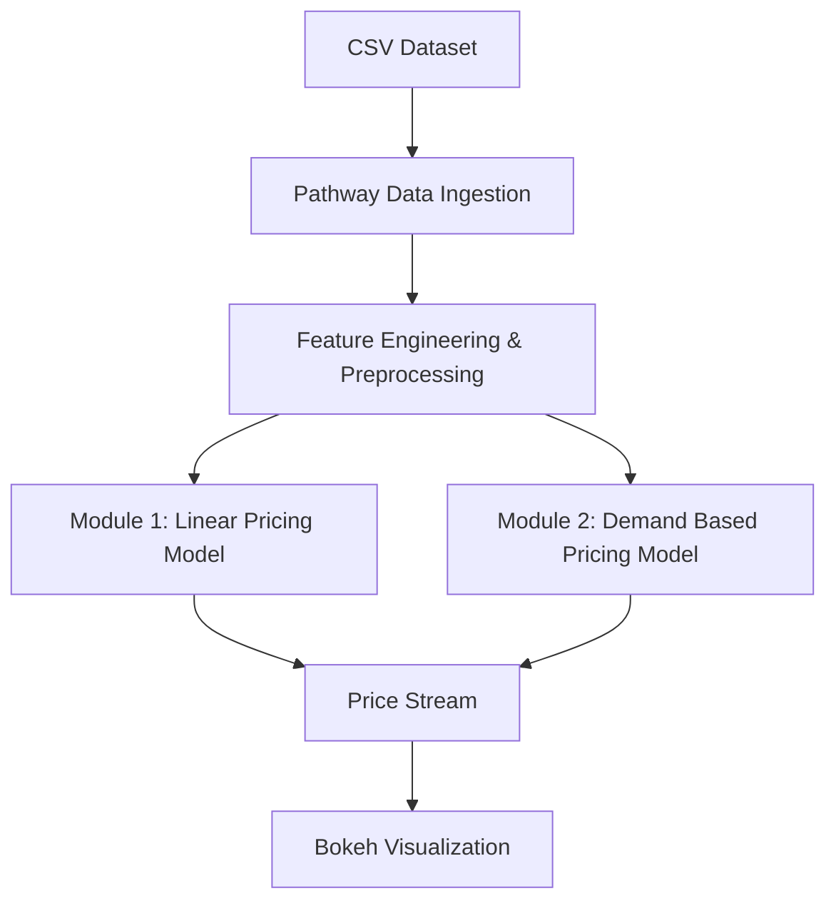

# Dynamic Pricing for Urban Parking Lots

- Capstone Project – **Summer Analytics 2025**
- Hosted by: Consulting & Analytics Club and Pathway

# Problem Statement

Urban parking spaces are a limited and highly demanded resource. Prices that remain static
throughout the day can lead to inefficiencies — either overuse or underuse.
To improve utilization, dynamic pricing based on demand, competition, and real-time
conditions is crucial.

The objective is to:

- Dynamically adjust parking prices in real time using vehicle, traffic and lot data starting from a base of *$10*
- Use only **Python, Pandas, Numpy and Pathway**
- Visualize pricing behavior in real time using *Bokeh*

# Tech Stack

- **Language**: Python  
- **Libraries**: 
  - pandas - for data manipulation  
  - numpy - for numerical operations  
- **Streaming & Real-Time Processing**: 
  - Pathway - to simulate real time data  
- **Visualization**: 
  - bokeh - for real time interactive plotting  
- **Data Structures**: 
  - Pathway Tables  
  - Pandas DataFrames
- **Environment**: 
  - Google Colab - for code execution

# Dataset Description

- **Duration**: 73 days  
- **Time points**: 18 per day (every 30 minutes from 8:00 AM to 4:30 PM)  
- **Parking lots**: 14

**Features include:**
- **Location**: Latitude and Longitude of parking slots
- **Capacity & Occupancy**
- **Queue length**
- **Traffic level**
- **Special day indicator**
- **Incoming vehicle type** (car, bike, truck)

# Modules Implemented

# Module 1: Baseline Linear Model
- Price is updated linearly with occupancy:
- Assumption: Price starts with $10 every day

# Module 2: Demand Based Pricing

A demand function is created using:
- Occupancy rate
- Queue length
- Traffic level
- Special day
- Vehicle type

# Architecture Diagram

# Project Architecture & Workflow

The dynamic pricing system is designed to process real time parking lot data and update prices using two pricing models. Here's how it works:

1. **CSV Dataset**  
   The raw data simulates parking lot conditions across 14 lots, including features like occupancy, queue length, vehicle type, traffic level, and more. This serves as the input for the system.

2. **Pathway Data Ingestion**  
   Pathway is used to simulate streaming by ingesting data row by row in timestamp order. This preserves the structure needed for realtime pricing updates.

3. **Feature Engineering & Preprocessing**  
   - Extract relevant features (e.g., occupancy rate = occupancy / capacity)(for Module-1).
   - Normalize or scale inputs like queue length and traffic (for Module-2).
   - Handle missing or noisy data where applicable.

4. **Module 1: Linear Pricing Model**  
   A simple pricing model where price increases linearly with occupancy.  
   Formula:  
   `Priceₜ₊₁=Priceₜ+ α ×(Occupancy/Capacity)`

5. **Module 2: Demand Based Pricing Model**  
   A more enhanced model that calculates a demand score using multiple features (occupancy, queue, traffic etc.) and adjusts price accordingly.  
   Formula:  
   `Priceₜ=BasePrice×(1+ λ ×NormalizedDemand)`

6. **Price Stream**  
   The output from the model is emitted in real time for each parking slot and timestamp. Pathway handles the continuous flow of this data.

7. **Bokeh Visualization**  
   Real time line charts plot the price evolution for each slot using Bokeh. These charts help visualize the price changes.

---

- This workflow ensures that the pricing system is data-driven, time varying, and transparent.
- I have also added the pdf files of both the plots if you want to hover over the plots then you need to run the code using the given data.
  
  - [Module 1 Price Plots](Module%201_price_plots.pdf)  
  - [Module 2 Price Plots](Module%202_price_plots.pdf)

